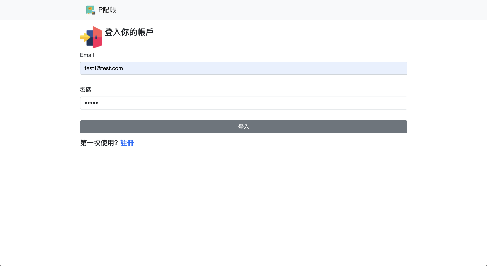
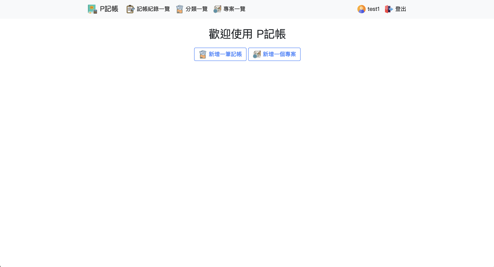
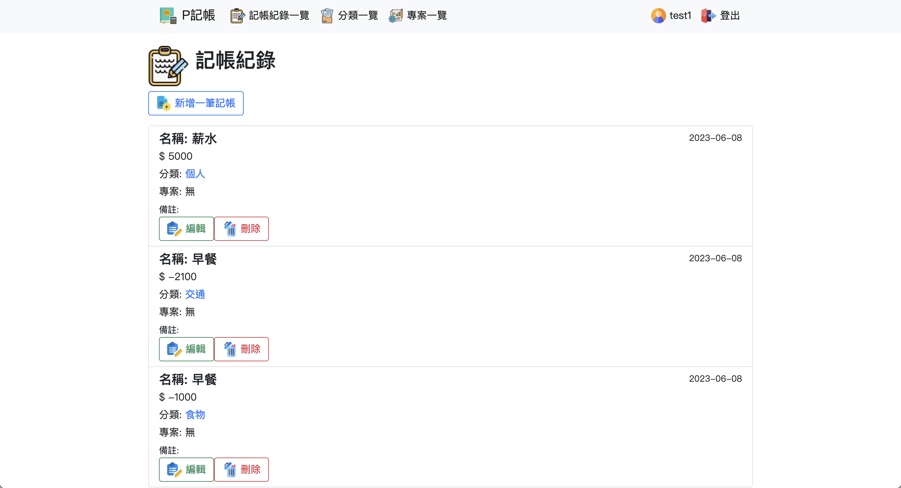
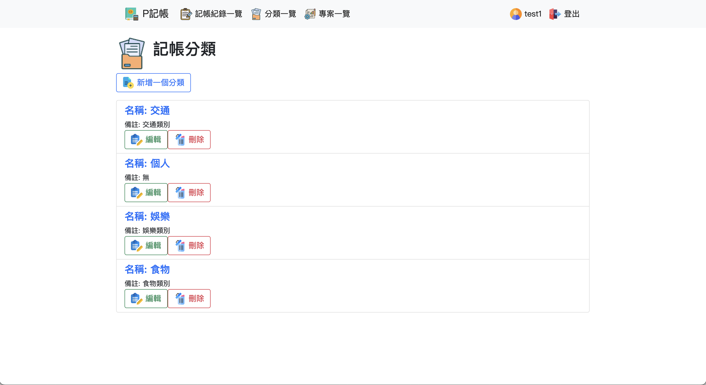
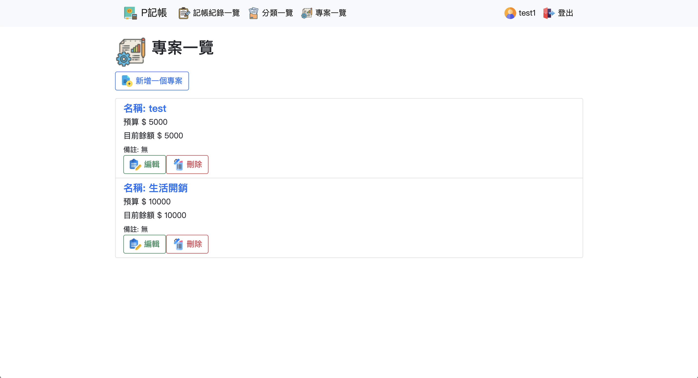
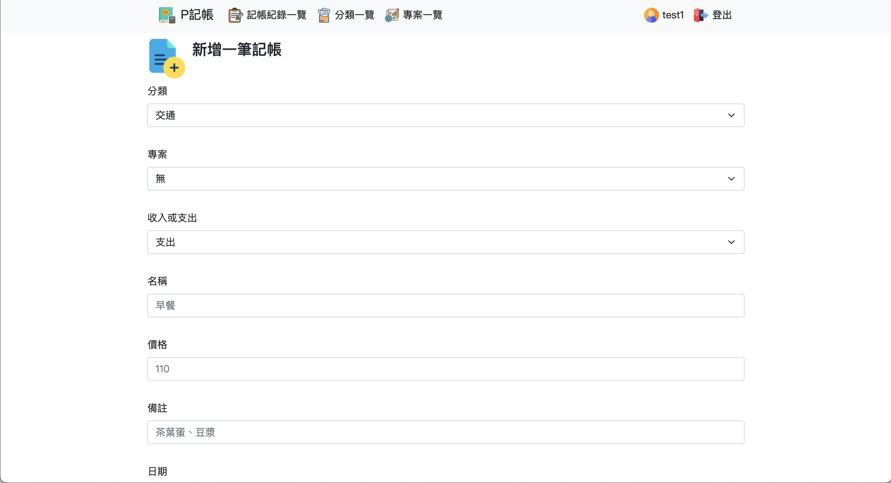

## P記帳

> 使用 Flask 製作的簡單記帳軟體

在 P 記帳中，你可以設定專案，來管理你的預算，也可以為每一筆記帳新增分類，來快速查看你在某個特定種類的花費

登入頁面


首頁


記帳紀錄


記帳分類


專案頁面


新增記帳


### Usage
* Clone 到本地端
* 安裝相關套件
  > 如果是使用 `pipenv` 可以直接 `pipenv install`
* 設定環境變數
  > CMD
  ```cmd
  > set FLASK_APP=main.py
  ```

  > Bash 
  ```bash
  $ export FLASK_APP=main.py
  ```

* 初始化資料庫
    ``` bash
    $ flask shell
    >>> from app import db
    >>> db.create_all()
    >>> exit()
    ```
* 執行程式
    ```bash
    $ flask run
    ```
* 再來就去 `127.0.0.1:5000` 就有了
